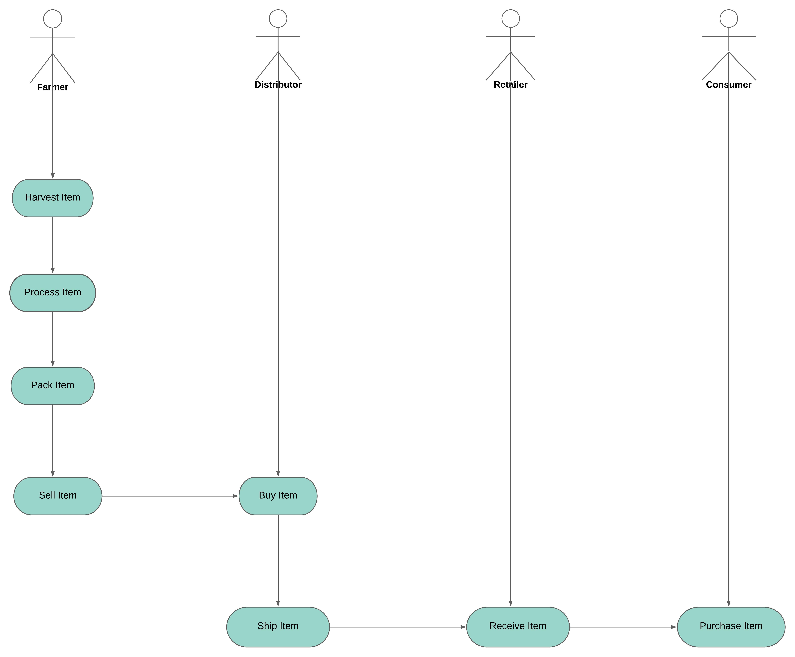
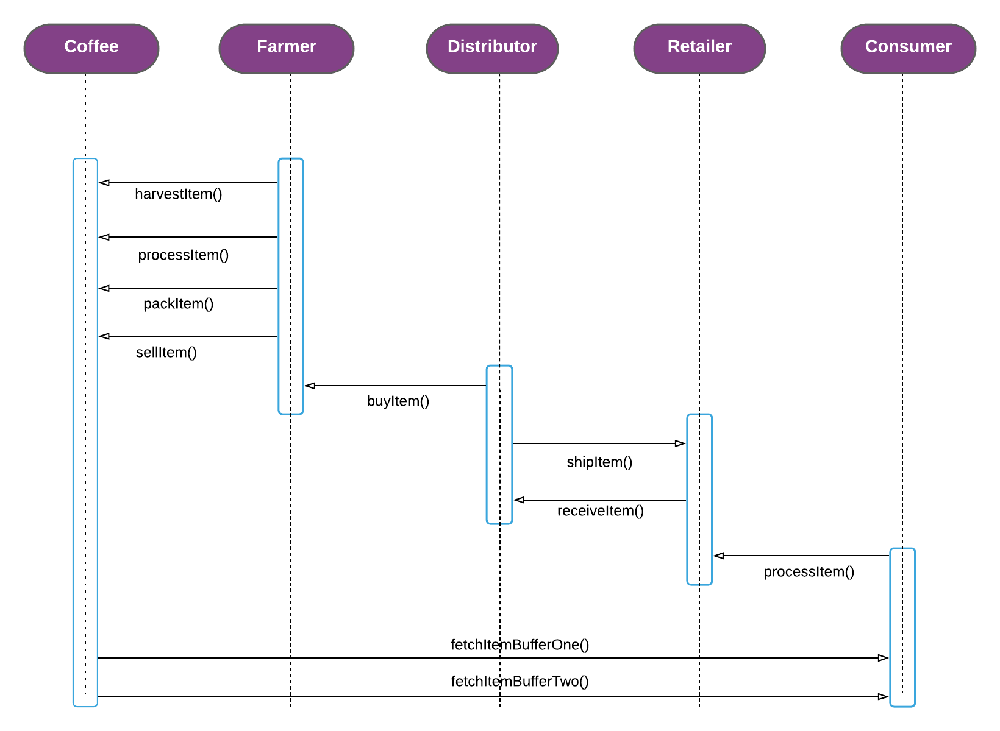
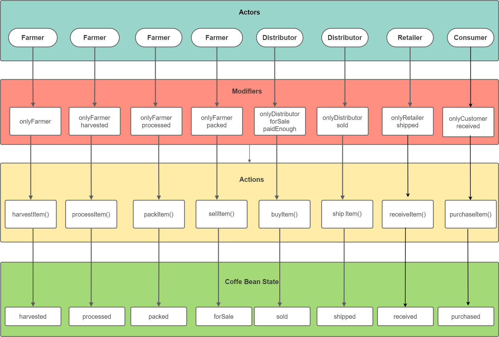
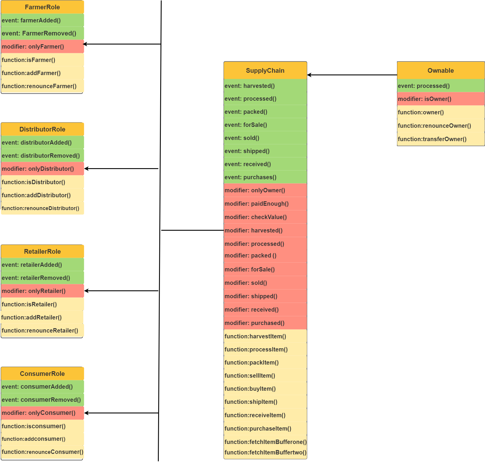

# Supply chain & data auditing

This repository containts an Ethereum DApp that demonstrates a Supply Chain flow between a Seller and Buyer. The user story is similar to any commonly used supply chain process. A Seller can add items to the inventory system stored in the blockchain. A Buyer can purchase such items from the inventory system. Additionally a Seller can mark an item as Shipped, and similarly a Buyer can mark an item as Received.

The DApp User Interface when running should look like...


## Project Write-up UML

* [Activity Diagram](https://lucid.app/lucidchart/16b5563c-b0fa-4c99-aa3f-45d49cae8065/view?page=0_0#?folder_id=home&browser=icon)
  


* [Sequence Diagram](https://lucid.app/lucidchart/invitations/accept/c004e17f-5891-4b4a-9d25-1a7c927686d8)



* [State Diagram](https://viewer.diagrams.net/?target=blank&highlight=0000ff&edit=_blank&layers=1&nav=1&title=state%20diagram#R7Z1bc6JME8c%2FTare9wJrYDheGqOJm2RNYszpxkIGFUVxAU%2B5yGd%2FBgGPRDtuQLKQVCXSnGd%2BPT30fwbPcGkwu7TVUffWIrp5xiEyO8MXZxwnizL96xnmvoHnBN%2FQsQ3im9iVoW6864ERBdaxQXRnY0PXskzXGG0aNWs41DV3w6batjXd3KxtmZtnHakdfcdQ11Rz1%2FpsELcb3JaAVvYr3eh0wzOzKFgzUMONA4PTVYk1XTPh8hku2Zbl%2Bp8Gs5JuemUXlou%2FX%2BWTtcsLs%2FWhG7FDw9HtWqvnlQmHTLVFq2Wxkb%2BbOdYMonVV2%2FW3qQZHNcsMkbpyu2z1mv6W4fkmM3z19saVaw9Xt3h6L3VanReGXd7H8vocdx6WXdcdeCdlz%2FC5NdHttrm4%2FZZpaX1qWvyvj1TNGHaCraZdw9U9k3eAKeWJ2j4xt62hG9DCYrrsLA%2BEC7K37NpWXy9ZpmUvLgYLuve7XFPztnc9KL0ao8czTHPbZlvjIdFJcHFqy7HMsasXbS08sWddLinBUdbOqShE0NTlOUOAuIJ3xX7x0nJx9dmnVbpewJe6NdBde043CXbAAVqhbwWuNV2ByoooMHbXKVUCoxp4R2d56BVA9ENQqeHiGlJ7Eauo9kC394PGUNCe2PfHp9kYA0Dj4gdtq7aX9SqgwwhybEEKLGvV7%2F%2BEWwaXy34DrDHhJIgbOLE4gidB2sVJRHHSdGHQ2zVaY9c6gBSpMIS2X5hpPnQBSOEcqfiRYpEoAKBCSUP1oLuqYR5qpNqUKH2C0KTemAOI4nOiEiCKk1JJVMkaOuODYc8jCunVD3mM3gBECTlRCRDFSyiNRIED39UVQ56r5ybPaXcAqMQcqvihkoVUtlKQrvmoypC7Pw%2FT28K8A8BJynGKHycOhJOcVpze3Zp7Xnh%2FBuAk5zjFjxOfzl45BCeH4jTtsv2nhgTJUCk5TvHjJPIAnMSIRFS8OBU12nVy9uM0vGHISwe%2FV19vWQBOLIqfp2OpQYsfMDUrNnbzn9%2BS%2FWwvfuKjTuLxBnUhTOvQyRFtGB9r8nM%2FbsItQxoNo1C67xQguOUJ9gOIyW05xoZtK8GOUQRikRn2pX4VD2TW0JxDguXzb4aoxcvxW6WvQXBLIM0OaN3CNiwqIq4wVI6A8OvAxRUxt8BSosCK4EpJDCuRlibrldnItjTdcWip7UVNumdI4frSuL4vCBDUEki%2F56j54e4HsaZq%2FUOgKRS0y3q9MLrnLiGgJZCVz0GLegpIM2gUq4nuuIdY6z0wBCmu%2BtAnkNwFm0C%2BPmfNz4exaWVtI22%2FBM7xBh7tZa1aZ4gwal4yr9dPENYSSOPnrC3WovRG0GjY2pZd90awrQdWg5SH1rjT3Q%2FhNYVw2NSuz3GnBYEwgeR%2FDqG3VubltDK4Gkuxau26xmh0KLhqzwzBzsRuCDdFCGsJKAM5a4u1KX48LY0d19rsy9m6phuTQ7T9orTd3P92B4MxZHQYm4BwkNO2WMsLxz43xJrIvbWI0Tb0QwLC%2BIUhvRe3P2spDoArLsUCwhdlp58vIOAt8NgI2eoUCgLaj9wTRU6YmPPxoNeAIJcOEUHcBW6pWKVUXNA1NcaGb0tcECSwuCDEyl%2BQG6m6%2BuB%2F%2F99PInplCOmMpUYL9MzK5fpCYknfDbbEdHTgAikBQtbTG0MYscV84PMbCFm5nJBU5o1HqURL1foQrj4oVyXUaCkNC5Lg4HL1ILEWS04jV%2FQ506SbnBNjslH14p%2Bx5dudkanSay7S1W3Tu31aGqhHH1ON9pzRaKUtCsBbrdFP9Ml1sQEtKJdRTaMz3F23MDOUiIHjr2ypjm4aQ91f7YHAOIsK8VYi3%2BqtZ8Jy8exsgRPoqoFqd4wh41oj38xwI%2F8awzugnzrB%2F8WdUp6G0baI21%2B%2FFlrb3pE1n73iOqO7Z6M3ZIb%2B6p%2BDVsrRp2bF7VMvu5ZRN4oOnPNz8wKD0LqvnREQQyr2ZYe8j%2B8h7UwqlCP2H2pPRDGVcao1nkPClMkxRH95tHq90giCTy4GJZWHF3EascrDVExhqmuMUhigvv9GQbH4G%2BKiQxs2aSC07sS7MaRhS4XA%2BC%2FFxZ0Z2SlpwQIVBxIcR5ghzftpvS9YCMJQLhyeSjhMCVujsU0xckBwORSuyuzu7uK5CnoxSa4TJqYTprPrVdRcwxoeUAlrPEPwVWl2WStCZq3hXCVMj0q4NfpLjJoEkrZ5RnWBIWLp16tZL0BUaZwOiTC184xUTBRJio8xjAqbnTI5sm2LFAP5WFs34EDpjsSQqtNFRLmWILzlQuBphEAWRU3NjWq94p2aC5xUVKVYsb%2BnVskZiRCschXwROPvU8MVYAKRB1VlUDYHH9oFBKpcAjzRTLW0QLUcTr%2BPql%2BUKtV%2B7Qvo8QpCVSoEnyxQtS0EpYWqwzOCbilSheKcfZzOVQhSuQh0oskYqUEKMu3iN6XqpdIr42cG8gpCnIoMfBao2plnlhasYBMsapSrpvJcrwhDSOIU51n5xLLyaX0IDNLyALDM0ZtbeHzTIWDlGfnEMvJ8OhusktVuU1TQub6Qyeuu6nqL%2BzErMAzRxFr%2FozeoAjDj8xR9elL0W28CUzi8i6ESkTyNF8P9vFU%2FGGLPLuRu6e0Wwhs4Rd%2FTXXceVo18mCE%2F7b7TCJW93506w7s8rDig13euk44eImfZbtfqWEPVLK%2Bs9IC0LIred7PQTYaWP16I7jgkoTF0E2qqGGZ4X55hZrgvHpUFIVh69VYWEKsEy3e6bdAq9MYoLdilBNlzfxdvnmFg8PZiEN2NCy3b%2B%2Fk14t3MfiZpJVg0jOl7ai7ggN51R3f3bLfx9q01yNchRhFt6dJo66bq0o7axuVFob04By1sdb62wcgyhq6zQ%2F7yQmJ1hlqrSRDR8aBoQzqPPFg%2FyIQz8EjZcgd82B1O4wws1Bu4DHsDrzVJq2x%2FSG0HMkiOB8semfAGgd8ODkd5g5JEaIB6A86wNzzqTXL%2Bev10475AxjLwYL0mG97w9Y7SaSKDBO0mCdl1BbPdJAp6lVr4oQxxBbDIlAlX4DH3Y7pJArSbhLPrDVXqDfLV5WRQVyHfe8OD9bFMeMMRnSSsiKfpJmFoNynD3vDWaZLb6fO0o%2BFHiDeAdb1MeAPPbT9CQzJKMnuS6CBDu0oZdodWt0neK8rF4DJUv%2Fa7A1iOzIQ7fNMzdCJdJWhw2HiXR8a8AVFvuHPKd%2B83DQLxBrCGmg1v%2BDH5JB7aUcqwL%2FSMJunp1muxW4N0lASw0JtJX0htPkmBdpIy7AqP%2FSa5cO%2FEi9EI8lWfQq5B%2F2VYCJS6DWfASXSSoIGBy3B2tUm9gR8Y0njUeoB4Qy5Cb2ZXjxCheYR3%2FCGRjhI0v4oz7A8Ds0lq95OPx14D8k1LQi5Dr%2FsDVtgjMkroNBklEdpZkrLrDpfUHX4Pe8PG%2Bw1kVIaQ69B%2FHR4wL5%2BmuwQVozdevJcxf9AHTVLBvYsG86pA%2FCEXozfH7IlHdJcihrAm0l2CxgecYX84p%2F6A3ytt%2FQn9gvhDLkf%2FbV6JP01mCSo4sBl2hjvqDIJ4fi4pGmTQnpCr0T81swQNDVyGHx0a1Bv%2B6NdSV62CMkvpEKPZBYcp9AckHPaHndCA%2BCS8gYV6wycz2rLgDWTYJJb757b1dl%2BDeEMuRv99nlU%2B0YMD9EEaZzg6lKk%2FvDn3E6snQb6TRswF6R%2F64AAV4Ta%2B6vbHOsMSzv00B4UyUc2xvu4ta0ivAaGZquMYGq2XNc63ppV%2FodL2lrEQUcTCUSU8mN15ZXq2enWCwAf3HUxZ94aSbhzDhynYbVUTkUcq4E%2FejBwezCdu52CHqxVYh0IcdbgW8vitiRs4DHkXs9C7vYX52kKcQU05LTpYLMhbLzyQ0LH0YGnjSCzCMHY%2BbzS%2BeqYVjP4xvxdNMWY0hfX4gwqKzJ4UzcORI040Md5pixRp6zXYYDQjDrZ6wUxSLZsULz4bnZe94HwjJIeHNCTcfO28w%2FoLwe%2BT7w5Pig%2FlH%2BQD0P1MuBHh5WMBwVuvBhK3j3Q0IHTRtix3fXP6QNW9tYj31Ff%2BDw%3D%3D)


* [Data Modelling](https://viewer.diagrams.net/?highlight=0000ff&edit=_blank&layers=1&nav=1&title=Data_model#R7Z1dU6s6F8c%2FjTPPc1GGd%2Bhltdq97dGqVbfuG4eS0GIpVF5s8aKf%2FYQCfdeuaovBE8%2FM2SVQCCs%2F%2Fk3WWglH0slg3PCNYe%2FCQ9g5Enk0PpLqR6Koqzr5f1IQpwWyqKQFXd9GaZEwL2jbbzgr5LPSyEY4WDow9DwntIfLhabnutgMl8oM3%2FdGy4dZnrN81aHRxWsFbdNw1kv%2F2CjsZbel8PPyX9ju9vIrC3y2Z2DkB2cFQc9A3mihSDo9kk58zwvTT4PxCXYS2%2BV2Sb939s7eWcV87IYbvnAXYL%2FVeU5sIvKO0SHNMj0o%2FZoTmTYye4Yfpsf8zs7aeeWQ1Hy5s4Z21k759cTXp1F7fBud%2F3MenD3U3p5vxnpFmN3HrH5BGOe264WD5KLCkXTsvWLfcqa333E8s0%2BKpv%2B2h4Zpu93sqFHPDnFSlJxgRHgiZe8UW54bZrQIEtkOZieSOD3ZDn2vj088x%2FOnlZEUnPw329NKjg8TKJMWI%2BezHWe1zPciF2GUVc7oBJ4Thbjmm%2FmFk9LZVjU7y8I1renf7Jo5QCKX1Dg1L7FLiMfvNumigRvYG%2BDQj8kh2ReqGVrx8uZoDqqoZ2W9BUilHEkjezi6szPP%2BSEfsjbNNxeI%2BpAw%2FDqtfi153Ax%2FgP0aIlb83%2F8%2FJk%2Brc%2Bg07KNWM%2BoByBNpIE%2Fks%2B2FNk%2F%2F8uOyKk1JceyuSz472Ao3AJuAYBPdqWWHDWyEnE28HoxWQ0JVTSuMVkFSNuCqrOMqKwXRejal9QYPCDNbee2fckh5sS77leoTgFeJCl4FTmPEfp5YfZPAFk6sFblmaHvE5DU7SJmFwPokNOW2c%2FcLAKtMBaw%2FSlwtC5tGtTBURU2gAdWBh2zLxn6qr57rxDBeHcLr%2FZ%2Fr27voGAF4VRiv%2B%2BdVt3S%2BOF5FaGdALUhaDYRgrIaXHBLrkt86NesAVlXGasm1VRJUGrR1gVVyI8SGJoYBOyLAqqLx8Oh1xgBgNQZs2YFVqegMZMMrj9j6Qz4nAhHUxpmkx5II4FOngs%2FdRlabvVVFkGeasqQXRt5Gj1Th4H2MW13mUOU81rirTgzArUoDbszlmQGmCFCfJ39Qn2fdJvdrd6LQgwgcIU6WT58D8wIicAJPA3JM4XYA8Du9mGiOIsjxLiscap4P%2FmjXAYhGKmI%2BP6s%2FWLAfU1Fo87wvMAt0v3sqh66it1rTkt4g1LJ4UdmpVXkqlHbdpbnw27%2BNWqxx6OEOXVbOzC6EWjqiRj%2BK2oIdm6pMm2PTDnYAtqNzSPmlvTjj9l8IsCxyVHZnkVqlwlm07Infgdg3Qmyzq1w7%2FF9IXF5gsaOyE6tJtPrjd8C2SbD9rXvi5DEQINhSEUYSdE5i4H4eXJ0Kqf0YTL%2FCoT6nnpz7AxMCJhXhIuYfzR3wEh05oUf56d%2FD7JRg1vtb98IboQ7BjIqoD1HhNfXjp38Mv%2FRgSaGDvxscGrYDiT4%2BP3HIHA9%2Bi0%2F3OgREKuJBzDm%2Fg%2Fp9p6PTzzgEeeZPOA5ZHb%2FRc24hg2%2BRjjjRjxrKFOzjrGq0eeZzYIFu%2BSuCrNtoXeHhqQ9BlgWTyo6swItUiOyG4Xf%2Bo78NWoFAO%2F7TaETn%2FRYEWhZLKvvIWxB5Kobey15OKK%2F2hEOV6OLY469OIbyyKFLpeNU1TlkmVlBo83LaARTYGgH2LuQ71fj6DAIsiyKVDthVgRUEKgR2PVoPZfYvYfbx6tVUXwTQfGQWRyp7qF7gVSpi9Uei6iQNguzXJYjUl8hLy4OhY8TZDHsnuX1iDf45CkLbiismaeb5BHyyuxKEhO70IGKssJI1fLI%2Fa%2FvkXpLCCqFrEKS7OkaAHdvF6e4EnkowbapkJ5%2BWJvsruWWScoEjD4J0PDD8ru1WQm%2BYFlfEYVrL%2FB7Ip272r5PB524u22CAxbqQ9k7ObKbU1FZ5r4wWKteZLv6xoRYLP2r5xUl7fbpOSVhsD7XKhzH7qNJezHTiuUE0IGJKS4USDf%2BwKu8XTx%2BuvPSj3wG%2BM0GxcP2I7eN7yO8AHYHZTfEvGgS92E6ISodrggl68eK5PLKmRrHMPUronixVhIg%2BERFV6pdc7eXpFiKi9CYR%2FPdEVKEjJsFE9Bt7xXawFwUVOI0yDS1NN9Q2J%2Bjh%2FB5dC7AYBR35MUxBpwoqUeELYwpatDCsex8pktH%2F5Gi%2BRmS07f%2FqCoMhD5FRKrK7qJXRYt2zss7cs%2F9JGV1IR6JIP6nrhi6kaB1aRs%2BJjEZhdfgYcHWAjEpUZCZSKqNF52vJMnOKMhllMvpehWap2YcW0TsiojX%2F7Dn%2Bcw%2FJMJCoyJVlIjo9WKpS4RTNx3Dbp7WoBLZn%2FWLQrIxDCGx05LiyaS2b6ds4q4qyiaPC8wRdDxriyYM4hBBHRZbqirzNnYTweXu703SoHFJlOYV0tgTeNmoEST3oCLodDYdOfNIzbPdjhKT%2BBMUvzejYu4AsWy%2FRkTfKROsd%2FIBecLWot9MQ4F5xEG6f1TR8IRyeGGfmvQIa7rJc0NJ18NZoVan4iV2gdeh7Jg6C7bRif4J%2B3Z7d%2FbImkEXGJCoy1hitX6FV5mXaaDXM%2FnZULYKq1nqo6jiWIahSkRfEUP0SqnKVMlQtz28bDoawKrxdtCanlQsIq1RkYDBWv8RqlTZZJSbbKqpdAuozasca8iHTQyUqYtwM1K%2BAqki0ieow8gmaAQ620SoRWpvWP%2BZVxYHIqkxFKJHR%2BhVaVY02WfWxiW3A8iYqgdWN75qNkTaCwEpFyIbB%2BiVYRdqkNejZwyGM1YvO399O%2BxLyXhuZjogPY%2FUr3QCdCmFdT3ttjdztM%2B5brxN0EjfUinEDWQJXpiJg9LOAPXRK5yqwmgAV14MGpJaBHRo2OnW9qNvb%2Bpra0QThptiu3Fqg1yrTEZ9ixH6FWDrWiFgm1uxhs39vONFWJ9b1eIIic3Arq2%2BQ2IDMIlmlJ1YHr8TD0uaPflK%2B5%2BqvWhKQ2UeWpaCuVm625vUmU%2Bwn2bQsE4x4IrDj%2FtNwUL82IAJLRfCV0qTOopWySse7mlaeW2jYPyHv%2BanTuve6jxDyWCy1%2FMDyEn3AgrOqEmDjmwel2QgDCLAsoFp6YHVFow9YYPwf1SfIbpiSpl5UIbiysGrpca2C34VXIK5A9z8muHYiq1m5uRwAcFVYXLX0uAq8TmF%2FABpbtRqk%2F6qc12TxOYIAy2Kr5QdWAAdXixxxZakrIGLd8ageqa1jCLEswvoDiAWvhldklwCQFWgTWH8PjHjYvQHJK4uulh9WXqJiuLWwkGDmHPgd4sHWl0acT5Bxi18Ntf0GAZYFV0u3UN4asLNzUPOSk8z9CgFWJsDyQvXy6VyuQ4BlsdUfAGw%2BU5oeYA2zD6FVIbTehV5QqyFQf4CKQBWj9Uu0SnS8lGeB1k4UQ2FtmZbmP19bEFhZbKv8sMrUvaIvIN%2BH0uo8qp0%2FwtUYQisLbJWfVom61%2FMlcQIIrSqhdeTEXCD4IC8Wi2uVn1ZZhtJalGMgd7pCiB08TJDF9y%2FFoNkGEKuy0Fb5iVXS%2BfQUEWvh0OwluB5HxBq%2B527NINiVWxYv%2BAHcgqdkfRO34cjbN7csdFB%2BbuGvztsLtzNQPiYru9ZrMtUlPS4tWMBrbmr%2BHUgWANyD5QRZWV6dc9Myi7OyRcvNlvXcwXTvPd%2BtkWt0tq0Bu%2BNyiiod41K2nOJ7nK37RzZyVth6iodaoU5lQ87STU1fx3XDgoobcS3MQZIlph1gxKmxEWf5e0ByVaSs5x76hhuQLjtoNYVdkWXplKVDdk1jFXk9%2F3ezxhaFbP4O%2B4Mgy%2Fwj5UdWrq6nqH0Dssv5lHYA4nXHxRQ05hcpXUrlOq%2F8ev7v90qsdwhpZblpP0BaFaCDoEgXnpaFcT5y4WEX1Xx%2FypTpGEFgm0dLXrtlA87Nh1EX72q8BdsoG0yTl%2FnYMUIyWFw6%2FSZ7ZVe48mw3nLeNKi83jSiv%2BGQCL%2FJNnH1rbvW1E0nalhOFht%2FF4dqJps03u%2B1NLQprPp0%2FRPORRvLjh2z3dOMxeRI5Jd%2Bsj7MnM93Kn1Nos4t8apYPbkyQvpUPablZVVX%2FHB%2FK6omEgvkQfigfokITHwKvfxYQfvVMUsGEKDsR4nrTtZrKrf6rrTdbAHnX1lv9HVmNIB267QDxt3I%2B3VWq%2BFD4zz7dK3zMX%2FZbFCG7de8gT%2FcMD%2F7b8FhaeubbO4%2B6%2FsnOo76i%2FdXVyOCB4agepvM4tsMZHuRzSoemZJtzOpKNeBGVDZqj7Y%2BqtFU%2BMEfex9uK39J7DQvHT5BW5Ele7VNC%2BRMkfflM0t4AJJu%2B54WLh%2FvGsHfhocRjcvov)




## Project Write-up Libraries

The *Roles* access library was used to implementation different roles in the access controls contracts.

*truffle-hd-wallet-provider* was used for transaction signing for addresses

## Project Write-up IPFS

*IPFS* was not used in the project

## Getting Started

These instructions will get you a copy of the project up and running on your local machine for development and testing purposes. See deployment for notes on how to deploy the project on a live system.

## Program Versions
* Node: v10.15.3 
* Solidity: v0.4.24 
* Truffle: v5.0.25 

## Contract Address on Rinkeby
https://rinkeby.etherscan.io/address/0x64b39d7af3926d2dcc8da02cb4dd4d831c9d8840
## Transaction ID And Contact Address

### migration
* Transaction hash: 0x49ed8e53ecb5348b2ec3a5a07338bf7d5988911d952bdf97a7d721adff83deb3

* Account: 0x2b90aa179ad4c8933949d363018dec91d32c7602

* Contract Address: 
0x6a95d3bd134863c5bc12b0effbde79583aeaa39e
* Gas price: 0.00000001 Ether
* Gas used: 238,594
* value sent: 0


### Farmer Role
* Transaction hash: 0x49ed8e53ecb5348b2ec3a5a07338bf7d5988911d952bdf97a7d721adff83deb3

* Account: 0x2b90aa179ad4c8933949d363018dec91d32c7602

* Contract Address: 
0x36df780ef2e7b4ba372af8c397f25a7bc8f17664
* Gas price: 0.00000001 Ether
* Gas used: 336,027 
* value sent: 0

### Distributor Role
* Transaction hash: 0xfb48695d931ad30c1a2cd9cc3b28a968320e2fea7aa0c22fc329b7fc54b6df97

* Account: 0x2b90aa179ad4c8933949d363018dec91d32c7602

* Contract Address: 
0x7106e75ea5167bc640dd8b3d6bd8112b5b4bb560
* Gas price: 0.00000001 Ether
* Gas used: 336,111 
* value sent: 0

### Reatiler Role
* Transaction hash: 0x32a38f58d355c8d6b06cac00e33ef81a659b3d1dc7a548dd7b366a16dd8ba963

* Account: 0x2b90aa179ad4c8933949d363018dec91d32c7602

* Contract Address: 
0xa5c958a38c73c856bb86443afa679e88b6f70068
* Gas price: 0.00000001 Ether
* Gas used: 336,087 
* value sent: 0


### Consumer Role
* Transaction hash: 0xa61f65b571270dedf4958a3540234b588f157691ca87dd8f847000218b0d33d8

* Account: 0x2b90aa179ad4c8933949d363018dec91d32c7602

* Contract Address: 
0x267e1e40f7bae8983893f7654f66a441abb2f2e9
* Gas price: 0.00000001 Ether
* Gas used: 336,051  
* value sent: 0

### Supply Chain
* Transaction hash: 0xd79ba8b2d776eaaec1372ec4349aa7dd4464b2143073263b7739e85cc2836066

* Account: 0x2b90aa179ad4c8933949d363018dec91d32c7602

* Contract Address: 
0x64b39d7af3926d2dcc8da02cb4dd4d831c9d8840
* Gas price: 0.00000001 Ether
* Gas used: 2,772,199  
* value sent: 0

### Prerequisites

Please make sure you've already installed ganache-cli, Truffle and enabled MetaMask extension in your browser.

```
Give examples (to be clarified)
```

### Installing

A step by step series of examples that tell you have to get a development env running

Clone this repository:

```
git clone https://github.com/udacity/nd1309/tree/master/course-5/project-6
```

Change directory to ```project-6``` folder and install all requisite npm packages (as listed in ```package.json```):

```
cd project-6
npm install
```

Launch Ganache:

```
ganache-cli -m "spirit supply whale amount human item harsh scare congress discover talent hamster"
```

Your terminal should look something like this:


In a separate terminal window, Compile smart contracts:

```
truffle compile
```

Your terminal should look something like this:


This will create the smart contract artifacts in folder ```build\contracts```.

Migrate smart contracts to the locally running blockchain, ganache-cli:

```
truffle migrate
```

Your terminal should look something like this:


Test smart contracts:

```
truffle test
```

All 10 tests should pass.


In a separate terminal window, launch the DApp:

```
npm run dev
```

## Built With

* [Ethereum](https://www.ethereum.org/) - Ethereum is a decentralized platform that runs smart contracts
* [IPFS](https://ipfs.io/) - IPFS is the Distributed Web | A peer-to-peer hypermedia protocol
to make the web faster, safer, and more open.
* [Truffle Framework](http://truffleframework.com/) - Truffle is the most popular development framework for Ethereum with a mission to make your life a whole lot easier.


## Authors

See also the list of [contributors](https://github.com/your/project/contributors.md) who participated in this project.

## Acknowledgments

* Solidity
* Ganache-cli
* Truffle
* IPFS
